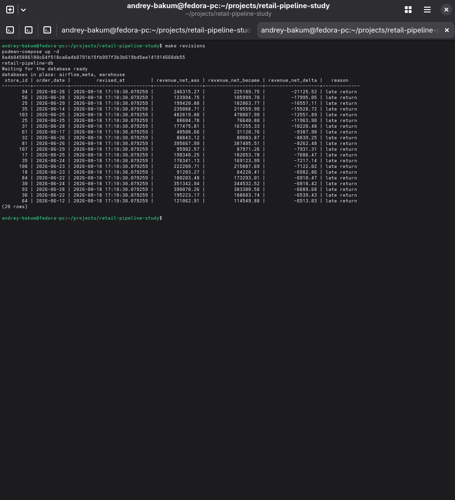
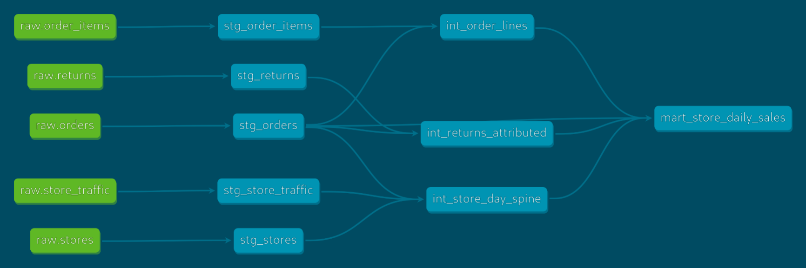
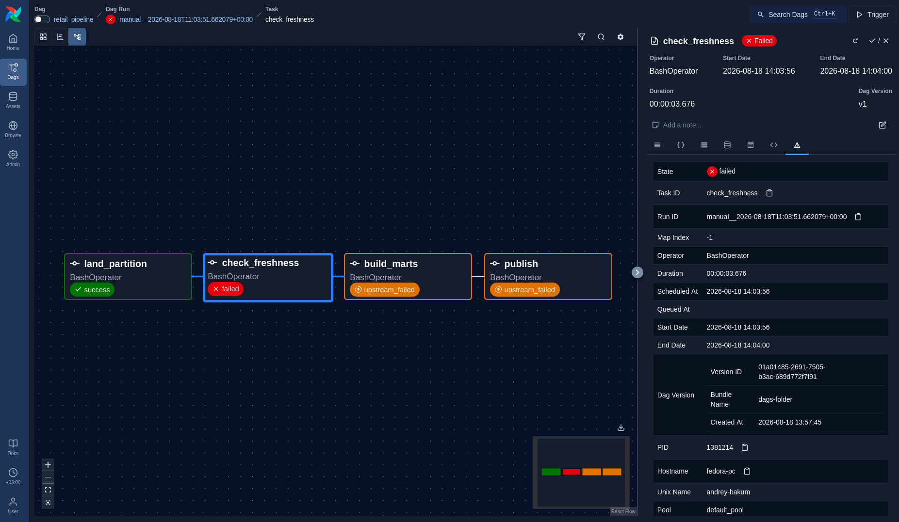
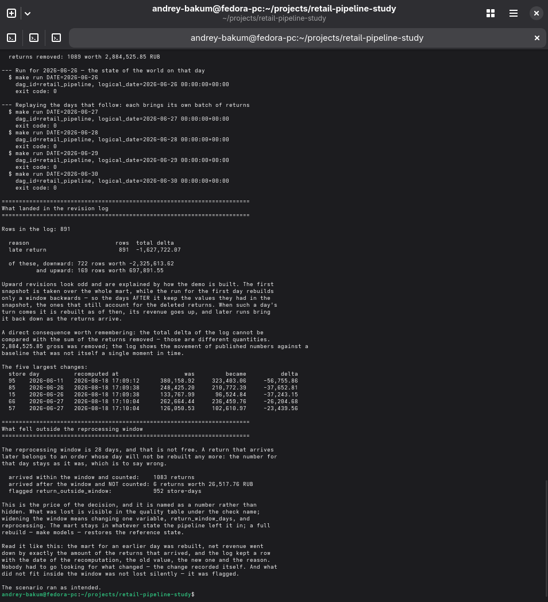
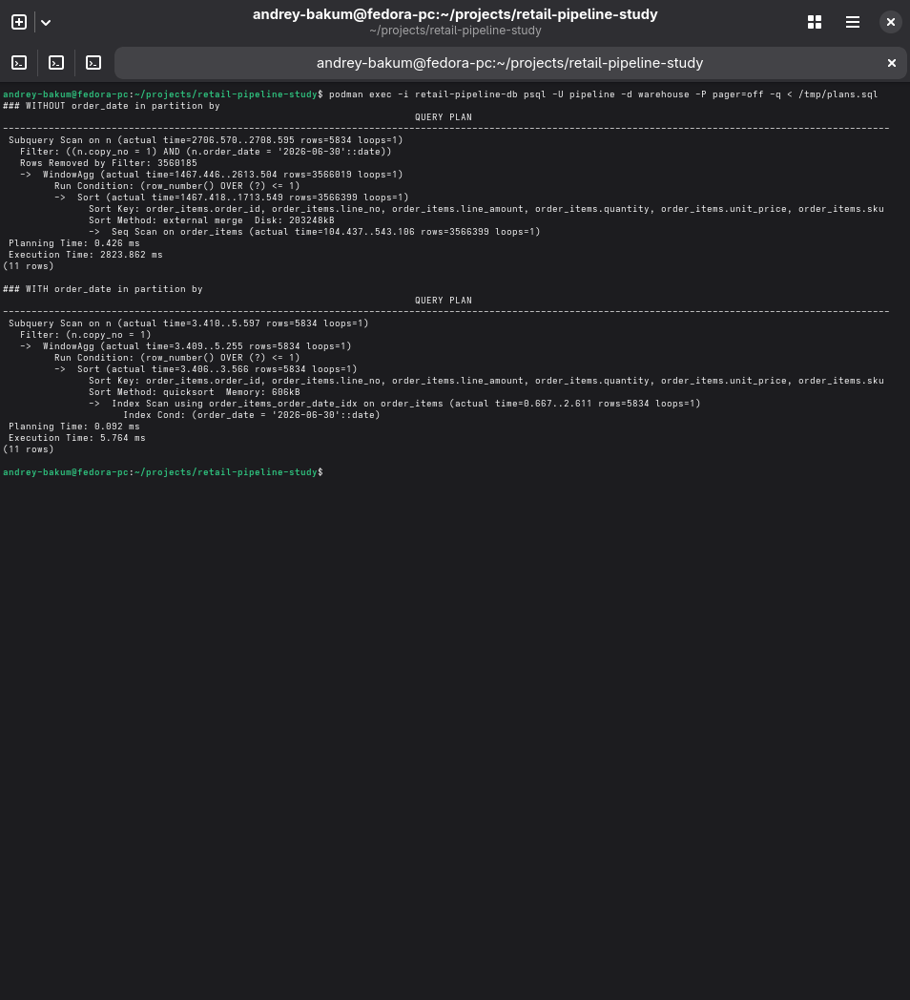
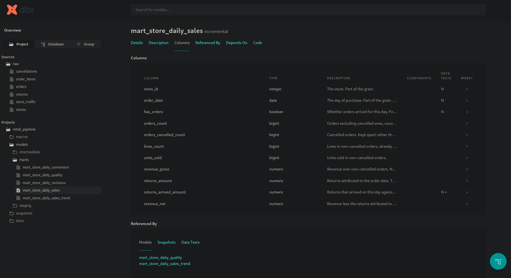

[](README.md) [](README.ru.md)

# Пайплайн розничной воронки

Ежедневный пайплайн, который считает выручку розничной сети по магазинам,
переживает поздние возвраты и битые источники и **никогда не меняет вчерашнее
число молча.**

PostgreSQL, dbt, Airflow, Python, pandas. Полтора года синтетических данных -
120 магазинов, 1,5 млн заказов, 3,6 млн позиций - выдает детерминированный по
сиду генератор, который входит в состав репозитория. Одна команда собирает все
это с нуля.



Каждый пересчет, изменивший опубликованное число, оставляет строку: какой
магазин, какой день, когда пересчитали, что было, что стало и почему. Эта
таблица - весь проект на одном экране.

## Три вопроса, которые задают первыми

**Когда задача падает,** цепочка встает до сборки витрин: проверки, охраняющие
публикацию, стоят выше витрин по графу, поэтому прошлое число не переписывается
вовсе - ни верным, ни неверным. Приходит алерт, витрина остается той же до бита.

**Пересчет за прошлый период** - одна команда, и повторный прогон дает то же
состояние: все пишется через delete-and-insert по ключу. Два прогона за одну
дату, пересчет пяти дней подряд и полная сборка с нуля дают одинаковые
контрольные суммы.

**Тест роняет цепочку, а не пишет предупреждение,** когда проблема чинится
пересчетом: задвоенное зерно, битая ссылка, непришедшая партиция. Когда не
чинится - магазин помечается флагом, а сеть считается дальше.

## Запустить

```bash
make demo                                    # все с нуля, минуты три
```

Это три шага подряд: сгенерировать полтора года данных, собрать витрины с
проверками, сверить их с сырым слоем. Дальше - по частям:

```bash
make run DATE=2026-03-14                     # прогнать пайплайн за дату
make backfill FROM=2026-03-01 TO=2026-03-05  # пересчитать период
make revisions                               # что изменилось, когда и почему
make reconcile                               # сверить витрины с сырым слоем
make                                         # остальные цели с описаниями
```

Нужны движок контейнеров, `make` и Python 3.10 или новее - больше ничего, и
настраивать нечего. `make up` сам определит, docker у вас или podman; `make psql`
открывает клиент внутри контейнера, чтобы не ставить его на хост. Каждый шаг сам
собирает себе виртуальное окружение. На Windows запускать через WSL2.

## Слои



Выше - все, из чего собрана витрина продаж: сырой слой слева, возвраты своей
веткой, календарный спайн, который задает зерно. Это отфильтрованный вид, полный
граф на 21 объект открывает `make docs`.

Три слоя, по каталогу на каждый. `staging` приводит форму и больше ничего,
`intermediate` сводит источники, `marts` отдает числа. Схемы в базе называются
так же.

Зерно фактовых витрин задает календарь, а не данные, - магазин на день от даты
его открытия, ровно 62 690 строк. День, за который из источника ничего не приехало,
должен быть виден строкой, иначе "магазин закрыт", "данные не приехали" и
"продаж не было" неразличимы, а различать их и есть вся работа.

> **Пустота не подменяется нулем.** Ноль означает "посчитали, и вышел ноль",
> пустое значение - "считать не по чему".

**Два решения, которые спрашивают первыми.** Возврат относится к **дате
заказа**, а не к дате приезда: он приезжает через несколько дней и уменьшает
выручку того дня, когда была покупка, - именно поэтому вчерашнее число и
меняется. Атрибуция по дате приезда дала бы неизменяемую историю и никакого
проекта. И дубли снимаются **по зерну, а не через `distinct`**: `distinct`
убирает только точные копии и молча оставляет две строки на одну позицию, если
копии разошлись, а оконная функция по `(order_id, line_no)` заявляет зерно и
заодно считает, сколько строк на позицию было в источнике.

## Стоп и флаг



Пайплайн, который падает от каждого дефекта, так же бесполезен, как пайплайн,
который не падает никогда. Граница проходит не по тяжести проблемы, а по одному
вопросу: **чинится ли она пересчетом.**

Задвоенное зерно чинится - значит считать по нему нельзя, и цепочка встает.
Сломанный дверной счетчик в одной точке не чинится ничем, и останавливать
из-за него всю сеть означает остаться без цифр по всем магазинам вместо одного.

| Проверка | Что делает |
|---|---|
| Уникальность зерна, не-null на ключах | **Стоп** |
| Ссылочная целостность возвратов и позиций | **Стоп** |
| Свежесть источника за целевую дату прогона | **Стоп** |
| Сверка позиций заказов с сырым слоем | **Стоп** |
| Согласие отмен со статусом заказа | **Стоп** |
| Конверсия выше порога "чеки больше трафика на 0,95" | Флаг |
| Возврат за пределами окна пересчета | Флаг |
| Пропущенная партиция, оставшаяся в истории | Флаг |

Стопы - обычные тесты dbt, и место, где они стоят, имеет значение. Тест в dbt
выполняется **после** того, как его модель собрана, поэтому тест на витрине
падает, когда неверная витрина уже лежит в базе. Значит все, что обязано не
пустить битое число в витрину, стоит выше по графу: сверка с сырым слоем и
ссылочная целостность проверяются на промежуточном. На витринах остаются
проверки формы - уникальность зерна и not-null.

Флаги - строки в таблице качества: магазин, день, имя проверки, причина словами,
- и один тест со строгостью `warn` печатает их сводку в каждом прогоне, иначе они
остались бы данными, которые надо не забыть посмотреть.

Пять дефектов заложены в **сыром слое, до всякого пайплайна**: поздние возвраты,
пропущенная партиция, дубли строк выгрузки, битый счетчик трафика, выбросы.
Дефект, подогнанный под тест, доказывает лишь то, что тест умеет ловить сам
себя.

Сверка в `make reconcile` намеренно написана **не** на SQL - она пересчитывает
все заново по сырому слою на pandas, потому что проверка тем же инструментом по
тем же моделям повторила бы их ошибку, не заметив ее.

## Вчерашнее число меняется, и видно почему



Три сценария воспроизводятся с нуля, каждый одной командой, и опираются на
дефекты, заложенные генератором, а не подстроенные под показ:

```bash
make scenario-late-return        # вчерашнее число изменилось, и видно почему
make scenario-missing-partition  # источник не приехал, цепочка встала
make scenario-broken-counter     # прибор врет, сеть считается дальше
```

Каждый из них **может упасть**: если реальность разойдется с рассказом, код
возврата будет ненулевым. Всегда зеленая демонстрация не доказывает ничего.

Поздний возврат - самый содержательный. Он отматывает время назад - убирает
возвраты, которые "еще не приехали", - и проигрывает пять дней подряд, как это
делал бы планировщик. Удаленные партиции возвращает само проигрывание, так что к
концу сырой слой в точности такой же, каким был. В журнале появляется
891 ревизия, все с причиной `late return`.

### Окно - 28 дней, и размер измерен

Ежедневный прогон пересобирает не один день, а окно назад. По 136 116 возвратам
медиана задержки 2 дня, 95-й перцентиль 19, 99-й - 28.

| Окно | Возвратов остается снаружи | На сумму |
|---|---|---|
| 14 дней | 10,5% | 38,5 млн |
| 21 день | 3,47% | 12,6 млн |
| **28 дней** | **0,78%** | **2,6 млн** |

Не 30, хотя максимум в данных ровно 30: взять наблюдаемый максимум значит
подогнать окно под выборку и сделать вид, что хвост ограничен. Он не ограничен.
То, что осталось снаружи, не теряется молча - такие дни помечены флагом
`return_outside_window`, сейчас их 952 магазино-дня, и расширять окно можно по
его показаниям, а не по квартальной сверке.

> **Окно - свойство конкретной витрины, а не общая настройка пайплайна.**
> У витрины конверсии его нет вовсе: ни трафик, ни заказы задним числом не
> переписываются. Ставить окно везде одинаково значит либо считать лишнее, либо
> не досчитывать нужное.

## Производительность, измеренная, а не заявленная



Сборка одной даты промежуточного слоя шла четыре с половиной секунды на 5 834
строки, и почти три из них занимал один запрос. Дело было не в объеме: фильтр по дате стоял **после** оконной функции, поэтому
дедупликация считалась по всем 3,5 млн строк, и только потом из результата
выбрасывалось все, кроме 5 834.

Предикат не проваливается ниже оконной функции - результат `row_number()`
зависит от того, какие строки попали в окно, - **кроме случая, когда колонка
фильтра входит в `partition by`**. Добавленный туда `order_date` сделал
проваливание законным. Это читается прямо по двум планам выше: строка
`Rows Removed by Filter: 3560185` исчезает, последовательный скан становится
индексным, сортировка уходит из внешнего слияния на 200 МБ в 606 КБ в памяти, а
запрос - с **2,8 секунды до менее чем 6 миллисекунд**, не изменив при этом ни
одного числа.

Полный разбор - в [`QUERY-PLAN.md`](QUERY-PLAN.md): он снят отдельным замером и
потому расходится в третьем знаке, зато там же разобран индекс, который оказался
дороже, чем экономил.

## Документация, которая не может устареть



Описания живут в том же yml, что и проверки на описываемой колонке, а
[`DICTIONARY.md`](DICTIONARY.md) - 21 объект, 149 колонок - собирается из них.
Он не может отстать от схемы, потому что собирается из нее, и сборка **падает**,
если хоть одна колонка осталась без описания: словарь с дырами хуже
отсутствующего, потому что по нему принимают решения, считая, что он полон.

Линейдж генерируется по той же причине. Картинка, нарисованная руками,
разъедется с кодом в первую же неделю.

## Как он строился

| Этап | Что появилось | Готово, когда |
|---|---|---|
| 0. Каркас | База, Makefile, каркас репозитория | `make up` поднимает базу ✅ |
| 1. Данные | Генератор синтетики, схема `raw`, заложенные дефекты | `make seed` дважды дает то же состояние ✅ |
| 2. Слои dbt | staging, intermediate, витрины продаж и конверсии | `dbt run` собирает витрины ✅ |
| 3. Тесты-гейты | Инварианты со стопом, проверки с флагом | Битые данные не публикуются ✅ |
| 4. Airflow | DAG, идемпотентность, окно пересчета, бэкфилл | Пересчет за прошлый день - одна команда ✅ |
| 5. Ревизии | Журнал ревизий и три сценария отладки | Каждый сценарий воспроизводится с нуля ✅ |
| 6. Документация | Словарь, линейдж, глава про план запроса | Выполнены все шесть критериев готовности ✅ |

Каждый этап кончался работающим состоянием, а не полуфабрикатом, поэтому в
истории коммитов видно не только что получилось, но и что по дороге
пересматривалось - решение **не делать** промежуточный слой инкрементальным,
например, отменено на последнем этапе по замеру, а не по вкусу.

## Чего здесь намеренно нет

**Алертов нет.** При падении команда возвращает ненулевой код и пишет строку в
`alerts.log`. Там, где были бы почта или мессенджер, интерфейс тот же - функция
обратного вызова, - но заводить SMTP значило бы требовать настройки в проекте,
который обещает одну команду.

**CI нет.** Гейты есть и возвращают ненулевой код, но автоматически их никто не
зовет.

**Театра оркестрации нет.** DAG выполняется через `airflow dags test` - целиком,
синхронно, без поднятого планировщика. Зависимости, ретраи и расписание при этом
объявлены, а `make airflow` поднимает веб-интерфейс, если он нужен.

**Ретраев по умолчанию нет.** Повтор помогает от транзиентной ошибки связи и не
помогает больше ни от чего: упавший тест данных от второго запуска не
позеленеет. Единственный ретрай стоит на заборе сырья - единственной задаче,
ходящей во внешнюю систему.

## Где что лежит

| Документ | На что отвечает |
|---|---|
| [`DICTIONARY.md`](DICTIONARY.md) | Что означает каждая таблица и колонка - собран, а не написан |
| [`QUERY-PLAN.md`](QUERY-PLAN.md) | Разбор одного тяжелого запроса с планами до и после |
| [`INCIDENTS.md`](INCIDENTS.md) | Что ломалось, как это выглядело снаружи и что с этим делать |

У `INCIDENTS.md` две половины. Первая - инциденты, ради которых пайплайн
построен. Вторая - те, на которые проект напоролся, пока его писали: проверка,
светившаяся зеленым, не сравнив ни строки; демонстрация, объяснявшая то, чего не
происходило; команда, работавшая только в оболочке того, кто ее написал. Ни один
из них не сообщил о себе сам. Это ровно тот класс отказов, против которого
построен весь проект. Прятать их в истории коммитов, где никто не прочтет, было
бы наведением порядка не в ту сторону.

## Лицензия

MIT, файл [`LICENSE`](LICENSE).
